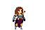
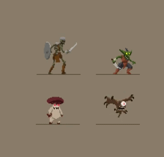

# 🎮 PlatformGame

Welcome to **PlatformGame**, an immersive 2D side-scrolling experience where survival is the ultimate goal! Battle fierce monsters, master your agility, and climb the high-score leaderboard in this action-packed adventure.

---

## 🚀 Key Features

- **Dynamic Combat:** Engage with multiple types of enemies, each with unique behaviors and attack patterns.
- **Advanced Mobility:** Master a diverse set of moves including Dash, Slide, and powerful Dash-Attacks to outmaneuver your foes.
- **Progress Tracking:** Secure login system that records your best scores and progress.
- **Rich Visuals:** Beautifully animated characters and detailed level environments featuring Goblins, Mushrooms, Skeletons, and more.

---

## 🕹️ Controls

Take control of your hero with these intuitive commands:

| Action | Key |
| :--- | :--- |
| **Move Left** | `A` |
| **Move Right** | `D` |
| **Jump** | `W` |
| **Slide** Escape | `S` |
| **Dash** Escape | `E` |
| **Attack** | `Space` |
| **Dash Attack** | `Tab` |
| **Back to Menu** | `Esc` |

---

## 👾 Meet the Cast

### The Hero

*Agile, strong, and ready for any challenge.*

### The Monsters

---

## 📺 Gameplay Demo

Experience the action in motion:


---

## 📂 Project Structure

```text
PlatformGame
├── data
│   └── userInfo.txt          # Persistent storage for user credentials and scores
├── pom.xml                   # Maven project configuration
└── src
    └── main
        ├── java
        │   ├── animations     # Logic for character animations and directions
        │   ├── entities       # Core game objects: Player, Enemies (Goblins, Mushrooms, etc.)
        │   ├── gamestates     # State machine management (Menu, Playing, Login)
        │   ├── inputs         # Input handling for Keyboard and Mouse
        │   ├── levels         # Level design, loading, and management
        │   ├── long_term_memory # Data persistence logic (UserManager)
        │   ├── main           # Game entry point and window orchestration
        │   ├── ui             # Custom UI components like Menu Buttons
        │   └── utils          # Game constants, helper methods, and asset loaders
        └── resources
            ├── Demo           # Gif demonstrations of gameplay
            ├── Enemy          # Sprite sheets for all enemy types
            ├── GUI            # Assets for health bars and other overlays
            ├── Level          # Tilesets, backgrounds, and map data
            ├── Menu           # Images for menus and buttons
            └── Player         # Animation frames for the main character
```

---

## 🛠️ How to Run

1. **Prerequisites:**
   - Java 25 or higher
   - Maven

2. **Execution:**
   ```bash
   mvn compile
   mvn exec:java -Dexec.mainClass="main.MainClass"
   ```

---

*Enjoy the game and good luck surviving!* 🗡️🛡️
