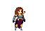
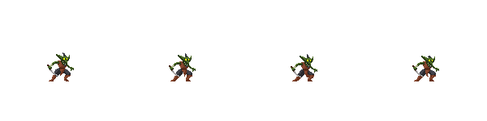
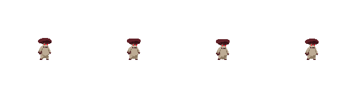
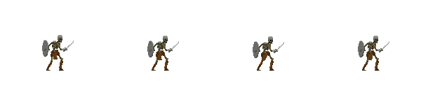

# 🎮 Platform Game 

## A 2D game where the task is to survive as long as possible and get scores. The best score will be recorded.

---

## The goals of the game are
- Killing attacking monsters
- Preventing the health from becoming zero
- Getting aids to restore health
- Resisting the attacks as much as possible

```
PlatformGame
├── README.md
├── pom.xml
└── src
    └── main
          ├── java
          │    ├── animation
          │    │   ├── Animation.java 
          │    │   └── Direction.java
          │    ├── entities 
          │    │   ├── Aid.java Enemy.java
          │    │   ├── Enemy.java 
          │    │   ├── Entity.java 
          │    │   └── Player.java
          │    ├── inputs 
          │    │   ├── KeyboardInputs.javats
          │    │   └── MouseInputs.java KeyboardInputs.java
          │    ├── main MouseInputs.java
          │    │   ├── Game.java
          │    │   ├── GameAlgorithm.javaGame.java    
          │    │   ├── GamePanel.javaGameAlgorithm.java    
          │    │   ├── GameWindow.javaGamePanel.java
          │    │   └── MainClass.javaGameWindow.java
          │    ├── score_recorder
          │    │    └── ScoreRecorder.java
          │    └── utils
          │         └── Constants.java
          └── resources
```

 The Player

---
### Monsters





---

