# 🎮 Platform Game

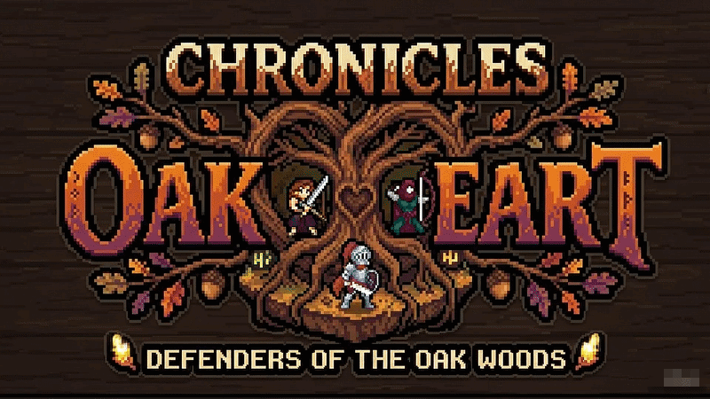

Welcome to **Oakheart Chronicles**, an immersive 2D side-scrolling experience where survival is the ultimate goal! Battle fierce monsters, master your agility, and climb the high-score leaderboard in this action-packed adventure.

---

## 🚀 Key Features

- **Dynamic Combat:** Engage with multiple types of enemies, each with unique behaviors and attack patterns.
- **Advanced Mobility:** Master a diverse set of moves including Dash, Slide, and powerful Dash-Attacks to outmaneuver your foes.
- **Progress Tracking:** Secure login system that records your best scores and progress.
- **Rich Visuals:** Beautifully animated characters and detailed level environments featuring Goblins, Mushrooms, Skeletons, and more.

---

## 🕹️ Controls

Take control of your hero with these intuitive commands:

| Action | Key | Animation                                             |
| :--- | :--- |:------------------------------------------------------|
| **Move Left** | `A` | 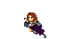    |
| **Move Right** | `D` | 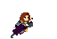   |
| **Jump** | `W` | 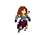        |
| **Slide** Escape | `S` |        |
| **Dash** Escape | `E` | 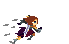        |
| **Attack** | `Space` | 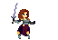      |
| **Dash Attack** | `Tab` | 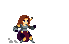 |
| **Back to Menu** | `Esc` | |

---

## 👾 Meet the Cast

### The Hero
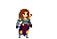
*Agile, strong, and ready for any challenge.*

### Knight (Allay)
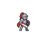
*Spawns when player needs some help.*

### Archer (Allay)
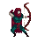
*Nimble, fast, spawns to support knight.*

### The Monsters
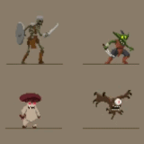
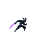
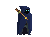
---

## 📺 Gameplay Demo

Experience the action in motion:

<video src="https://github.com/GorSargsyan2004/PlatformGame/issues/45#issue-5363945867" controls="controls" muted="muted" width="100%"></video>

---

## 📂 Project Structure

```text
PlatformGame
├── data
│   └── userInfo.txt          # Persistent storage for user credentials and scores
├── pom.xml                   # Maven project configuration
└── src
    └── main
        ├── java
        │   ├── animations     # Logic for character animations and directions
        │   ├── entities       # Core game objects: Player, Enemies (Goblins, Mushrooms, etc.)
        │   ├── gamestates     # State machine management (Menu, Playing, Login)
        │   ├── inputs         # Input handling for Keyboard and Mouse
        │   ├── levels         # Level design, loading, and management
        │   ├── long_term_memory # Data persistence logic (UserManager)
        │   ├── main           # Game entry point and window orchestration
        │   ├── music          # Responsible for playing music of the game
        │   ├── ui             # Custom UI components like Menu Buttons
        │   └── utils          # Game constants, helper methods, and asset loaders
        └── resources
            ├── Allay          # Allay entities - Knight
            ├── Demo           # Gif demonstrations of gameplay
            ├── Enemy          # Sprite sheets for all enemy types
            ├── GUI            # Assets for health bars and other overlays
            ├── Level          # Tilesets, backgrounds, and map data
            ├── Menu           # Images for menus and buttons
            └── Player         # Animation frames for the main character
            └── tracks         # Music tracks to play 
```

---

## 🛠️ How to Run & Build

### 1. Prerequisites
- **Java 25** or higher
- **Maven**

### 2. Run from Source (Development)
```bash
mvn compile
mvn exec:java -Dexec.mainClass="main.MainClass"
```

### 3. Build Runnable JAR (Production)
To create a standalone executable file:
1.  **Package the project:**
    ```bash
    mvn package -DskipTests
    ```
2.  **Locate the executable:**
    The runnable JAR is located at `target/PlatformGame-1.0-SNAPSHOT-jar-with-dependencies.jar`.
3.  **Run the JAR:**
    Move the JAR file to the root directory (so it can access the `data/` folder) and run:
    ```bash
    java -jar PlatformGame-1.0-SNAPSHOT-jar-with-dependencies.jar
    ```

---

*Enjoy the game and good luck surviving!* 🗡️🛡️
